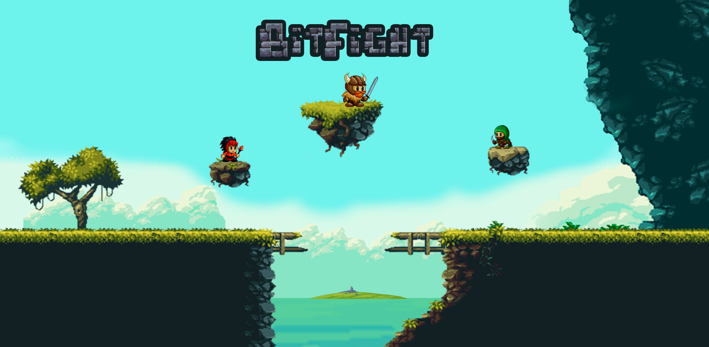

<h1 align="center">
    
</h1>

## :interrobang: The Game

BitFigth is a indie game developed by me [@dnsgusttavo](https://ithub.com/dnsgusttavo) . It's a amazing 2d side view game in pixel style. The base idea is a PvP fight game, in order to eliminate the opnente and for that you can use the bonuses that will be dropped by the mobs of the game.

## :rocket: Technologies
:small_blue_diamond: [Javascript](https://developer.mozilla.org/docs/Web/JavaScript)  
:small_blue_diamond: [p5.js](https://github.com/processing/p5.js)  
:small_blue_diamond: [p5.play](https://github.com/molleindustria/p5.play/)  
:small_blue_diamond: [p5.collide2D](https://github.com/bmoren/p5.collide2D)  

## :bookmark_tabs: Credits
Most characters, sprites and images is from internet or other creators. Below is the credits of yous works.  
 :link: Game characters:  
:file_folder: [CraftPix](https://craftpix.net/freebies/assassin-mage-viking-free-pixel-art-game-heroes/)
 :link: Map tileset:  
:file_folder: [Ansimuz](https://opengameart.org/content/depixelized-version-of-magic-cliffs-environment-part)
